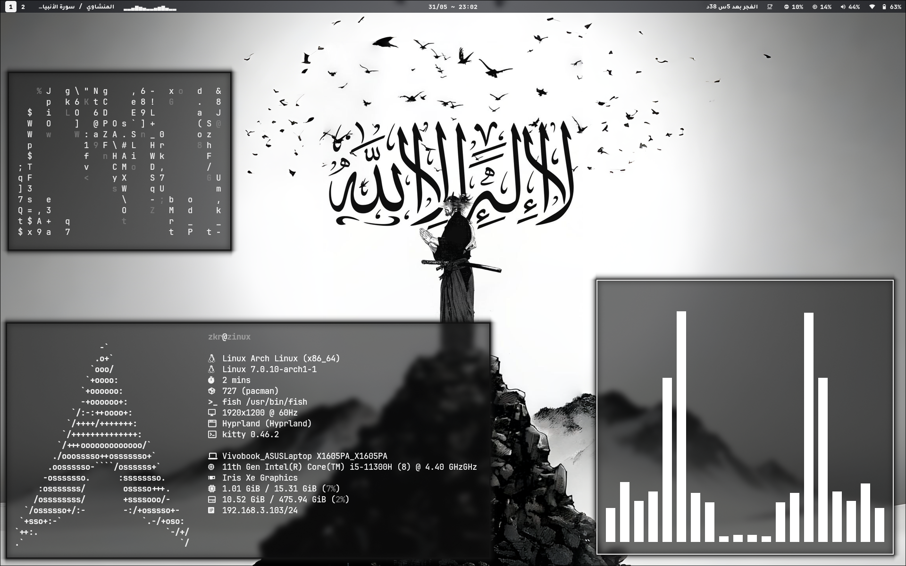

# Hyprland Modular Configuration (Lua-Driven)

A highly customized, modular dotfiles repository for Hyprland. This setup features a centralized flat-file theme database for system-wide color coordination and 5 dynamically switchable Waybar layouts handled via Rofi.

---

## 📊 System Architecture

### 1. Window Manager Configuration (`.config/hypr`)
Unlike traditional single-file monolithic setups, this configuration utilizes a modular Lua structure layout. The core entry point structures the components hierarchically:
* `modules/binds.lua` - Keybindings and window management shortcuts.
* `modules/decorations.lua` - Blurring, rounded corners, shadows, and animations.
* `modules/autostart.lua` - Background daemons, ambient services, and environment initialization.

### 2. Centralized Theming Engine
The system color palette is managed via `~/.config/themes/master_themes.conf`, acting as a flat-file database. When a theme is selected via Rofi (`theme_selector.sh`):
* It parses the specific hex values.
* Generates `current_colors.css` for Waybar.
* Generates `colors.rasi` for Rofi.
* Exports variables to native Lua modules for Hyprland evaluation.

---

## 🛠️ Dependencies

Ensure the following packages are installed on your system before deploying:

| Component | Required Packages |
|-----------|-------------------|
| **Core WM** | `hyprland`, `xdg-desktop-portal-hyprland` |
| **Bar & Menu** | `waybar`, `rofi-wayland`, `jq` |
| **Shell & Terminal** | `kitty`, `fish`, `fastfetch` |
| **Python Modules** | `python-requests` (Required for prayer times local caching) |
| **Typography** | `ttf-jetbrains-mono-nerd`, `ttf-vazirmatn-fonts` (Arabic fallback layout) |

---

## 🚀 Installation & Deployment

### 1. Clone the Repository
\`\`\`bash
git clone https://github.com/zkrzk/hyprland-lua-dotfiles.git
cd hyprland-lua-dotfiles
\`\`\`

### 2. Run the Deployment Script
\`\`\`bash
chmod +x install.sh
./install.sh
\`\`\`

---

## 🖼️ Preview

